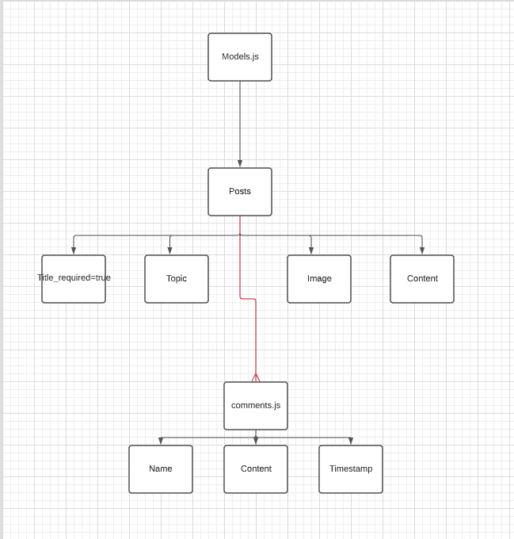
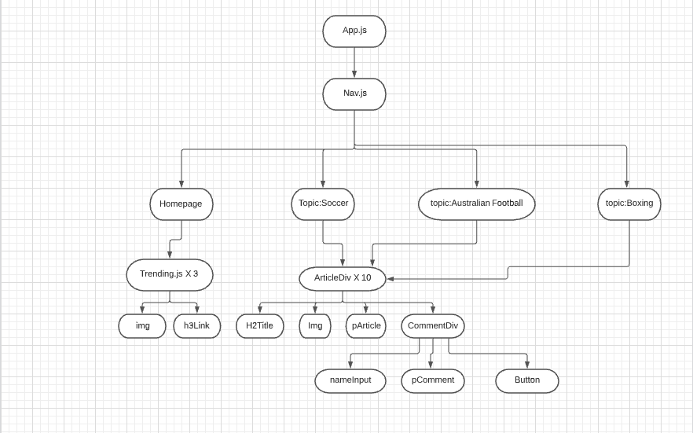
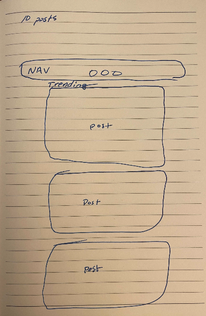
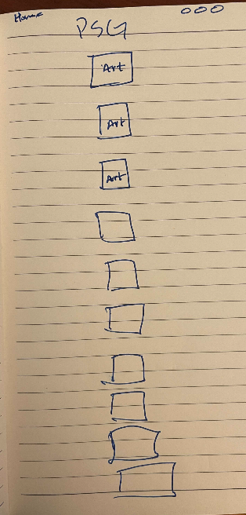

# Dread-It

Sports Update Center

### Date: 8/25/2021

#### By: [Brandon Hernandez](https://github.com/brandonhernandez123) | [Sam Bassong](https://github.com/sbassong) | [Derek Valenciano](https://github.com/dvalenciano)

---

**_Description_**

This project is to show the understanding of fullstack web development from start to finish.

The idea behind this project is to show the result of a 24 hour hackathon styled project. The basis idesa of this project was modeled from the Reddit forum and contains articles that pertain to current sporting topics. Think ESPN The Ocho

You can access the App by following this [link!]()

**_Technologies Used_**

- React
- MongoDB
- Express
- Mongoose

**_Screenshots_**

Below are snippets of the early workings that indicate the beginning level of building a can online application using a fullstack method

Entity Relationship Diagram

Component Hiearchy Diagram

Mock Up Main

Mock Up Post

**_Future Updates_**

- [ ] Randomizer of Trending Articles
- [ ] Update to include user profiles

**_Credits_**

Eddie Lin - https://jsfiddle.net/elin/7m3bL/
-The CSS used for the fireworks background was used from this site and this creator

Google Fonts - https://fonts.google.com/specimen/Amatic+SC?query=ama
Amatic SC was the font used from Google Fonts
